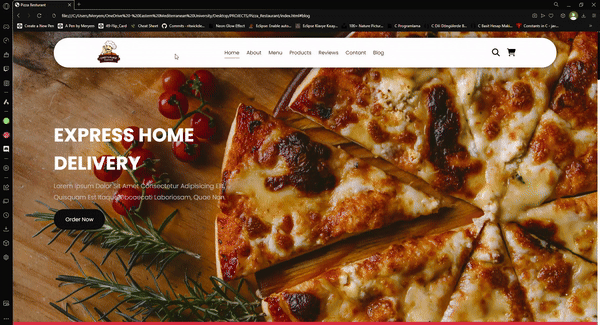

# 🚀 Pizza Web Application 

Welcome to the Pizza Restaurant! This project is a fully responsive web application for a pizza restaurant built using HTML, CSS and JavaScript. The site offers a user-friendly interface where customers can explore our menu, make reservations and order online.

# 🧩 Features 

- Responsive Design: Makes the website look great on all devices, from desktops to mobile phones.
- Dynamic Menu: Browse a variety of pizzas, desserts and drinks with detailed descriptions and images.
- Online Ordering: Place orders directly on the website with an intuitive and easy-to-use form.
- Reservation System: Make dining reservations with a simple and fast reservation form.
- Interactive User Interface: Smooth navigation and interactive elements for an enhanced user experience.
  
# 💻 Used technologies 

HTML: The structure of web pages.

CSS: Style and layout, including responsiveness.

JavaScript: Dynamic behavior and interaction such as form validation and menu interactions

# 📌 Preview:

